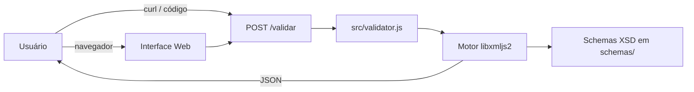
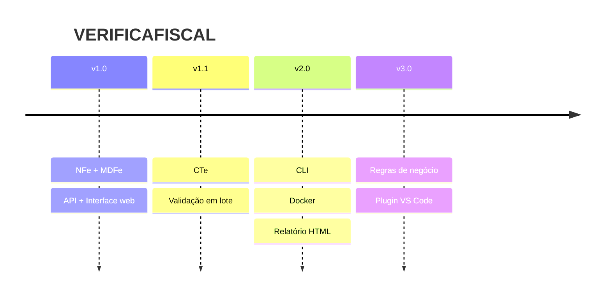

# Documento de Visão — VERIFICAFISCAL

> **Versão:** 2.0
> **Propósito:** Alinhar stakeholders sobre o que é e para onde vai o VERIFICAFISCAL.

---

## 1. Propósito

Validador **offline**, **gratuito** e **open-source** de documentos fiscais eletrônicos brasileiros (NFe, NFCe, MDFe) contra os schemas XSD oficiais da SEFAZ.

O XML **nunca sai da máquina do usuário**. Um comando `npm start` e está pronto.

---

## 2. Problema e Concorrência

Empresas brasileiras precisam validar XMLs fiscais antes do envio à SEFAZ. Ferramentas existentes:

| Tipo | Exemplos | Problema |
|------|----------|----------|
| **ERP/Plataformas pagas** | SAP, Oracle | Custo alto, vendor lock-in |
| **Validadores online** | Sites gratuitos | Expõem dados fiscais sensíveis |
| **IDEs XML** | XMLSpy, Oxygen | Caras, complexas, licenças |
| **CLI** | xmllint | Sem interface, sem detecção automática |

**VERIFICAFISCAL** é a alternativa leve, local, gratuita, com API REST + interface web + detecção automática de tipo.

---

## 3. Público-Alvo

| Perfil | Como usa | Frequência |
|--------|----------|------------|
| Desenvolvedor | API REST em testes e CI/CD | Diária |
| Auditor fiscal | Interface web para colar e validar | Semanal |
| Contador | Interface web | Mensal |
| DevOps | curl em scripts de build | Por commit |

---

## 4. O que faz (v1.0)

### 4.1. Arquitetura

### 4.2. Funcionalidades

| # | Funcionalidade | Essencial? |
|---|---------------|------------|
| F1 | Detecta tipo de documento pela tag raiz do XML | Sim |
| F2 | Valida XML contra XSD oficial (com includes/imports) | Sim |
| F3 | Retorna JSON: `{ valido: true/false, erros: [...] }` | Sim |
| F4 | Cada erro com linha, coluna, mensagem e código | Sim |
| F5 | Interface web com textarea + botão Validar | Sim |
| F6 | Suporte a NFe, NFCe e MDFe (10 tags MDFe + 1 NFe) | Sim |
| F7 | Config editável no topo do `src/validator.js` | Sim |
| F8 | CORS habilitado | Desejável |

### 4.3. Documentos Suportados

| Tipo | Pacote | Versão | Tags |
|------|--------|--------|------|
| **NFe/NFCe** | PL_010c_NT2022_002v1.30 | 4.00 | `NFe` |
| **MDFe** | PL_MDFe_300b_NT012025_1.05 | 3.00 | `MDFe`, `enviMDFe`, `eventoMDFe`, `mdfeProc`, `consSitMDFe`, `consReciMDFe`, `consStatServMDFe`, `consMDFeNaoEnc`, `distMDFe`, `mdfeConsultaDFe` |

### 4.4. Requisitos Não-Funcionais

| Categoria | Critério |
|-----------|----------|
| Performance | Resposta < 500ms para NFe típica (200KB) |
| Portabilidade | Windows, Linux, macOS |
| Manutenibilidade | `server.js` < 30 linhas, `src/validator.js` < 80 linhas, modular |
| Segurança | libxml2 com proteção XXE padrão |

---

## 5. O que NÃO faz (v1.0)

- Validação de regras de negócio (cálculos, duplicidade)
- Assinatura digital de XMLs
- Emissão ou transmissão para SEFAZ
- Conversão de formatos (XML → PDF, etc.)
- Armazenamento de documentos

---

## 6. Tecnologias

| Componente | Tecnologia |
|------------|-----------|
| Runtime | Node.js 18+ |
| Servidor HTTP | Express ^4.18 |
| Validação XSD | libxmljs2 ^0.33 (binding nativo libxml2) |
| Frontend | HTML + CSS + JS puro |

**Build:** libxmljs2 requer ferramentas C++ (Visual Studio / build-essential / Xcode CLI).

---

## 7. Roadmap

---

## 8. Métricas de Sucesso

| Métrica | Alvo v1.0 |
|---------|-----------|
| Precisão | 100% dos schemas oficiais |
| Performance | < 500ms por validação |
| Cobertura de tags | 100% mapeadas no CONFIG |

---

## 9. Glossário

| Termo | Definição |
|-------|-----------|
| **XSD** | XML Schema Definition — define estrutura e tipos de um XML |
| **Tag raiz** | Primeiro elemento do XML, identifica o tipo do documento |
| **Include/Import XSD** | Mecanismo para um XSD referenciar definições de outro |
| **libxml2** | Biblioteca C para processamento XML |
| **node-gyp** | Ferramenta para compilar addons nativos do Node.js |

---

## 10. Referências

- [Manuais SEFAZ NFe/MDFe](https://www.gov.br/nfce/pt-br/documentacao/manuais)
- [libxmljs2](https://github.com/mmarcon/libxmljs2)
- [Express](https://expressjs.com/)
- [libxml2](http://xmlsoft.org/)
